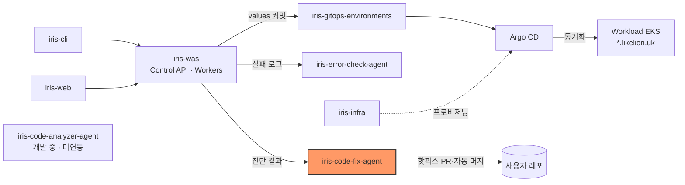
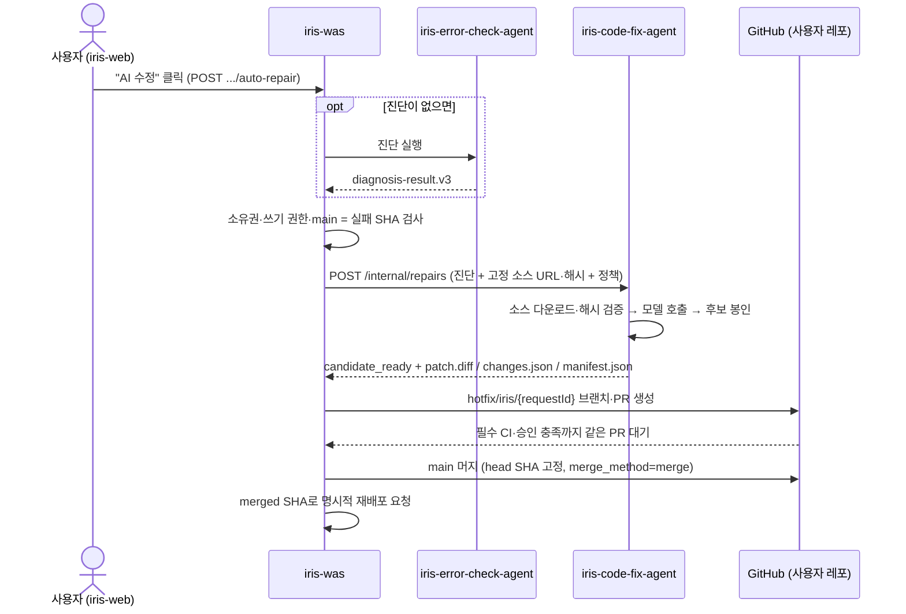

# iris-code-fix-agent

Likelion에서 진단 결과와 고정 소스 스냅샷으로 코드 수정 후보를 만드는 에이전트다.


[](https://github.com/2026-softbank-1/iris-code-fix-agent/actions/workflows/ci.yml)

## 시스템 내 위치



- 입력: [iris-was](https://github.com/2026-softbank-1/iris-was)가 [iris-error-check-agent](https://github.com/2026-softbank-1/iris-error-check-agent)의 `diagnosis-result.v3`와 고정 소스 URL·해시를 보낸다.
- 출력: 수정 후보 artifact를 WAS에 돌려준다. 핫픽스 PR·머지는 WAS가 한다(다이어그램의 점선은 WAS를 거친 결과다).

## 원클릭 수정 흐름



근거: [iris-was #67](https://github.com/2026-softbank-1/iris-was/pull/67)(원클릭 게시·자동 머지), [#70](https://github.com/2026-softbank-1/iris-was/pull/70)(진단 자동 시작·머지 후 재배포), iris-was ADR 0026.

- 이 서비스(후보 API)는 GitHub 자격 증명이 없고 브랜치·PR을 만들지 않는다.
- `iris-auto-repair` 코디네이터(이 레포 CLI)는 WAS 원클릭과 **별개인 독립 실행 경로**다. 기본은 핫픽스 PR 생성 후 main 머지이고, `--draft-pr`이면 `PR_OPENED`에서 멈춘다. 상세는 [docs/auto-repair.md](docs/auto-repair.md).

## 주요 기능

- 동기 후보 생성: `POST /internal/repairs`가 생성 완료까지 기다리고, 요청 결과를 디스크에 영속한다. `Idempotency-Key`로 같은 요청은 모델을 다시 부르지 않는다.
- `candidate_ready`는 제안된 변경이 있다는 뜻이다. verification은 `not_run`(owner: `was`)이며 빌드·배포 성공을 뜻하지 않는다.
- 비코드 계획은 소스 다운로드·모델 호출 전에 `configuration_required`로 끝낸다.
- [수정 프롬프트](src/iris_code_fix_agent/prompts.py)는 소스 결함과 환경·운영자 변경을 구분하고, 정확한 편집과 검증 인계를 요구한다. 읽기 전용 환경 매니페스트는 쓰기 권한 없이 참고 자료로만 들어간다. 지원 범위와 한계: [설계·프롬프트 점검](docs/code-repair-design.md#프롬프트와-현재-설계-점검-2026-10-03).
- 기본 모델은 `gpt-6.1-sol`, reasoning effort `medium`이다.

## 안전장치

- 다운로드한 소스를 실행하지 않는다. 소스·로그는 데이터로만 다룬다.
- 소스는 HTTPS이면서 `FIX_ALLOWED_SOURCE_HOSTS`(기본 `s3.amazonaws.com`)에 정확히 일치하는 호스트만 허용한다. 리다이렉트·위험한 아카이브(traversal, 링크, 특수 파일)는 거부하고, 서명 URL은 저장하지 않는다.
- archive·manifest SHA-256으로 스냅샷을 고정하고, 수정은 정확한 preimage 해시와 고유 텍스트 일치가 있어야 적용한다. 보호 경로(`.env*` 포함)·비밀값은 수정 대상에서 뺀다.
- 비용 상한: 요청별 `policy.maxCostUsd`와 서비스 `FIX_MAX_COST_USD`를 함께 적용한다. WAS는 `REPAIR_AGENT_MAX_COST_USD`(기본 USD 1)로 요청한다.
- 재시작이나 불확실한 provider 결과는 `UNKNOWN_OUTCOME`으로 남기고, 과금 가능성이 있는 모델 호출을 자동으로 재시도하지 않는다.
- 컨테이너는 UID 10001로 실행하고 `/data`에 상태를 둔다.

## 기술 스택

Python 3.11 · FastAPI · Uvicorn · httpx · Pydantic 2 · boto3(코디네이터 S3) · PyJWT(GitHub App) · SQLite · uv · Ruff · pytest

## 디렉터리 구조

```
src/iris_code_fix_agent/  API, 소스 검증, 모델 runner, 후보 적용, 코디네이터
tests/                    오프라인 테스트 (모델·WAS·S3·GitHub는 fixture)
docs/                     API 계약, 설계, 코디네이터, 검증·평가 기록
examples/                 고장 난 Python 소스 fixture와 요청 생성기
scripts/                  실제 모델·WAS·S3/Docker 평가 스크립트
```

## 빠른 시작

```sh
uv sync --extra dev
cp .env.example .env   # 비밀값, 신뢰 소스 호스트, 검증된 모델 가격 설정
set -a; . ./.env; set +a
uv run iris-code-fix-agent   # :8000
```

필수 환경변수:

- `API_KEY`: 공백 없는 ASCII 32자 이상
- `OPENAI_API_KEY`, `FIX_INPUT_PRICE_PER_MILLION`, `FIX_OUTPUT_PRICE_PER_MILLION`: 실제 모델 호출 시 필수. 가격은 운영자가 넣는다.
- `FIX_ALLOWED_SOURCE_HOSTS`: 실제 소스 버킷 호스트
- `FIX_DATA_DIR`: 요청 기록·artifact 저장 경로. 로컬 영속 스토리지만 지원한다.

나머지는 [.env.example](.env.example). 로컬 fixture·curl 예시·Docker 실행·원문 운영 메모는 [docs/local-development.md](docs/local-development.md).

```sh
uv run ruff check . && uv run pytest
```

## 인터페이스 요약

| 방향 | 내용 |
| --- | --- |
| WAS → agent | `POST /internal/repairs` (`iris.repair-request.v1`), `GET /internal/repairs/{requestId}`, `GET .../artifacts/{patch.diff\|changes.json\|manifest.json}`. 모두 `X-API-Key` |
| 공개 | `GET /healthz` (인증 없음) |
| WAS 설정 | `REPAIR_AGENT_URL`, `REPAIR_AGENT_API_KEY`(= 이 서비스 `API_KEY`), `REPAIR_AGENT_SOURCE_HOSTS`(= `FIX_ALLOWED_SOURCE_HOSTS`) |

상세 계약: [docs/api.md](docs/api.md). WAS 쪽 연동: [iris-was #56](https://github.com/2026-softbank-1/iris-was/pull/56).

## 배포

- 매니페스트: iris-infra [`runtime/code-fix/`](https://github.com/2026-softbank-1/iris-infra/tree/main/runtime/code-fix). `iris-platform` 차트(`helm/charts/iris-platform`)와 `clusters/aws-dev-management/values/platform.yaml`에는 이 컴포넌트가 없다.
- 별도 Argo Application `iris-code-fix-runtime`이 `runtime/code-fix/kubernetes.yaml`을 `iris-platform` namespace에 동기화한다. `argocd.yaml`은 운영자가 한 번 수동 적용한다.
- 구성: Deployment 1 replica(Recreate), gp3 PVC(`/data`), 포트 8000 내부 Service, WAS API ingress만 허용하는 NetworkPolicy. 비밀값은 운영자가 만든 Secret `iris-code-fix-agent`(`API_KEY`, `OPENAI_API_KEY`)에서 읽는다.
- 이미지: ECR `iris/code-fix-agent`에 수동 push하고 digest로 고정한다(현재 커밋 `cfcbd86`). 이 레포에는 이미지 빌드·배포 workflow가 없어서 main 머지가 배포로 이어지지 않는다.
- `iris-auto-repair` 코디네이터는 운영 매니페스트에 없다.

## 현재 상태 / 한계

- 구현: 후보 생성 API, 영속 요청 기록·artifact, WAS 원클릭 흐름 연동, 독립 코디네이터(S3 저장·핫픽스 PR·머지).
- 후보 검증(빌드·실행)은 하지 않는다. 검증은 WAS 책임이며, 원클릭 흐름은 GitHub 필수 검사 통과를 머지 조건으로 둔다.
- 단일 호스트 전제: SQLite receipt와 파일 락으로 조정하므로 네트워크 파일시스템·다중 replica는 지원하지 않는다. `FIX_MAX_CONCURRENT`는 프로세스 단위다.
- 실제 모델·WAS 검증 범위와 비용: [docs/live-evaluation.md](docs/live-evaluation.md).

## 문서

- [docs/api.md](docs/api.md): 내부 API 계약
- [docs/code-repair-design.md](docs/code-repair-design.md): 설계·책임 분리·프롬프트 점검
- [docs/auto-repair.md](docs/auto-repair.md): 독립 코디네이터, GitHub 인증, 소스 고정
- [docs/local-development.md](docs/local-development.md): 로컬 실행·fixture·컨테이너 원문
- [docs/validation.md](docs/validation.md): 구현 검증 기록
- [docs/live-evaluation.md](docs/live-evaluation.md), [docs/evaluation-summary.json](docs/evaluation-summary.json): 실제 연동 평가
