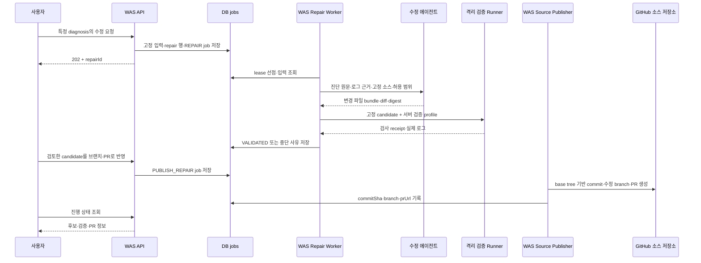

# 로그 진단 → 코드 수정 → WAS의 브랜치 push·PR 설계

작성일: 2026-10-03. 상태: 전체 WAS 연동 흐름의 **구현 제안**. 수정 에이전트의 후보 생성 MVP는 구현했으며, 아래 WAS API·테이블·Job·격리 검증·브랜치 push·PR 흐름은 아직 구현하지 않았다. 사용자가 선택한 반영 방식은 **수정 전용 브랜치에 push한 뒤 PR로 반영**이다.

권장 흐름은 `저장된 진단 + 실패 당시 소스 → 수정 후보 생성 → 격리 검증 → WAS의 소스 브랜치 생성·push → PR`이다. 오류 에이전트는 원인과 해결 방향을 제공하고, 새 [iris_code_fix_agent](https://github.com/2026-softbank-1/iris_code_fix_agent)는 실제 원문에 적용되는 변경을 만든다. WAS는 작업 상태, 입력 고정, 검증 실행, GitHub 권한과 PR 생성을 소유한다.

## 구현 현황 (2026-10-03)

이 저장소는 인증된 동기 `POST /internal/repairs`, 영속 결과 조회, 인증된 candidate artifact 다운로드, 고정 원문 검증, 제한된 모델 수정 제안 및 정확한 변경 적용을 구현했다. 실제 계약과 실행 방법은 [API 문서](api.md)와 [README](../README.md)를 따른다. SQLite receipt와 로컬 파일 lock으로 같은 호스트의 중복 호출을 막고, 불확실한 모델 호출은 `UNKNOWN_OUTCOME`으로 보관하며 자동 재호출하지 않는다.

후보 `candidate_ready`의 검증 상태는 `not_run`, 소유자는 `was`다. 오프라인 fake-provider fixture 검사는 실제 모델 품질, WAS 실행, 격리 검증, GitHub push·PR 또는 운영 배포의 성공을 입증하지 않는다. 아래 내용은 향후 전체 통합 설계로 유지한다.

## 1. 최신 코드 기준과 현재 기능

관련 checkout은 `git pull --ff-only`로 갱신했다. 분석기 작업 브랜치는 `origin/main`과 동일하다. 기존 feature checkout은 브랜치를 유지했으며, WAS 설계 기준은 최신 `iris-was-upstream/develop`이다.

| 저장소 | 확인한 기준 | 역할 |
| --- | --- | --- |
| iris-code-analyzer-agent | main `d87da438a1f38ba8ec35af54080bb08409183ae7` | 고정 소스 분석·원문 manifest·모델 호출 기반 |
| iris-error-check-agent | main `40d39767fcd209c24e84dd88aebeb9979d0a6e9b` | `/diagnose`, diagnosis-result.v3, 선택적 소스 진단 |
| iris_code_fix_agent | 새 저장소, 커밋·branch 없음. 로컬 clone 완료 | 수정 전용 API·후보 생성의 구현 위치 |
| iris-was | develop `4b76c5fade96d22cdea3be89b5649abc21a29624` | 최신 진단 API·빌드 로그·DB jobs·GitHub 연동 |
| iris-was | origin/main `35d7eb92d12044cc9171eb5f2e2a16355007068b` | 진단 기능의 release 병합 확인 |
| iris-web | main `636ee153ec7575f7a7f97744d9608f28bb4027b1` | 화면 확장 대상 |
| iris-infra | origin/main `240b8b729ce34bdc7036260b166e66d3dd547de8` | Worker·App·artifact 보관 설정 확장 대상 |

현재 코드에서 확인한 사실:

| 확인 내용 | 설계에 미치는 영향 | 코드·문서 근거 |
| --- | --- | --- |
| 오류 에이전트는 `/diagnose` 완료 응답을 기다리는 HTTP 계약이며 해결책은 template다 | 기존 snippet을 patch로 적용하지 않고 수정용 계약을 추가한다 | [오류 API](https://github.com/2026-softbank-1/iris-error-check-agent/blob/40d39767fcd209c24e84dd88aebeb9979d0a6e9b/src/ai_error_check_agent/api.py#L169), [WAS 진단 안내](https://github.com/2026-softbank-1/iris-was/blob/4b76c5fade96d22cdea3be89b5649abc21a29624/docs/diagnosis-api.md#L123) |
| WAS는 202 + BackgroundTasks + DB 폴링으로 진단을 제공한다 | 수정·검증·push는 기존 DB jobs에 넣어 재시작 후 복구할 수 있게 한다 | [진단 라우터](https://github.com/2026-softbank-1/iris-was/blob/4b76c5fade96d22cdea3be89b5649abc21a29624/app/routers/diagnosis_router.py), [ADR 0020](https://github.com/2026-softbank-1/iris-was/blob/4b76c5fade96d22cdea3be89b5649abc21a29624/docs/adr/0020-ai-error-diagnosis-via-agent-server.md) |
| 원본 diagnosis-result.v3는 WAS의 JSONB에 보관된다 | WAS 진단 행 ID와 원본 결과 digest로 특정 진단을 고정한다 | [DeploymentDiagnosis](https://github.com/2026-softbank-1/iris-was/blob/4b76c5fade96d22cdea3be89b5649abc21a29624/app/models/deployment_diagnosis.py#L40) |
| 오류 에이전트의 diagnosis_id는 매번 UUID로 생성되며 결과 재조회 기능이 없다 | diagnosisId만 보내지 않고 WAS가 원문 결과 또는 immutable artifact를 전달한다 | [service.py](https://github.com/2026-softbank-1/iris-error-check-agent/blob/40d39767fcd209c24e84dd88aebeb9979d0a6e9b/src/ai_error_check_agent/service.py#L75) |
| 소스를 못 읽어도 로그 진단은 성공할 수 있다 | 진단 SUCCEEDED와 코드 수정 가능 여부를 별도 판정한다 | [소스 진단](https://github.com/2026-softbank-1/iris-error-check-agent/blob/40d39767fcd209c24e84dd88aebeb9979d0a6e9b/src/ai_error_check_agent/source_analysis.py#L303) |
| WAS는 고정 source SHA의 GitHub tarball을 S3에 저장한다. 진단은 하루 보관 중 23시간 이내 snapshot을 사용한다 | repair 접수 시 원본을 보존하고 archive·파일 digest를 추가해야 한다 | [빌드 소스](https://github.com/2026-softbank-1/iris-was/blob/4b76c5fade96d22cdea3be89b5649abc21a29624/app/services/build_service.py#L125), [진단 입력](https://github.com/2026-softbank-1/iris-was/blob/4b76c5fade96d22cdea3be89b5649abc21a29624/app/services/diagnosis_service.py#L277) |
| 기존 Git 쓰기는 GitOps 서비스 디렉터리용이다 | 사용자 소스 저장소용 publisher를 추가한다 | [GitHubClient](https://github.com/2026-softbank-1/iris-was/blob/4b76c5fade96d22cdea3be89b5649abc21a29624/app/clients/github_client.py#L92) |
| 분석기의 모델은 도구 사용이 제한되어 있고 ContextBundle은 선별·마스킹된 자료다 | 원문 별도 보관, 수정 전용 prompt/schema/runner, 변경 적용기를 둔다 | [OpenCode 서버](https://github.com/2026-softbank-1/iris-code-analyzer-agent/blob/d87da438a1f38ba8ec35af54080bb08409183ae7/src/iris_analyzer/opencode/server.py), [원문 소스 도구](https://github.com/2026-softbank-1/iris-code-analyzer-agent/blob/d87da438a1f38ba8ec35af54080bb08409183ae7/src/iris_analyzer/build/source.py) |

`docs/1002-integration-design.md`의 다섯 Worker·PipelineRun·vendored diagnosis v2 흐름은 별도 feature 설계 기록이다. 현재 WAS 진단 v3 계약의 기준으로 사용하지 않는다.

## 2. 책임과 실행 흐름



이는 향후 제품의 생성/반영 두 동작을 분리하는 API 제안이다. 운영에서 자동 PR 생성까지 허용한다면 같은 정책으로 publish job을 연속 접수할 수 있다. 이번 설계 작업에서 실제 원격 push나 PR 생성은 하지 않는다.

| 담당 | 실행 책임 |
| --- | --- |
| 오류 에이전트 | hypotheses·remediation·source findings 제공. 현재 `/diagnose` 계약 유지 |
| 수정 에이전트 | 실패 SHA의 원문을 읽고 최소 수정 후보와 근거를 생성·봉인 |
| WAS Repair Worker | 입력 고정·lease·비용·시도 관리, 후보 재구성, 검증 Runner 호출·결과 판정 |
| 격리 검증 Runner | 서버가 선택한 compiler/test/build 및 필요한 smoke 실행. GitHub 쓰기 token 미제공 |
| WAS Source Publisher | 설치 접근 재확인, 정확한 candidate commit, 수정 브랜치 push·PR 생성 |

수정 에이전트에 GitHub token을 주지 않는다. 런타임에 필요한 비밀값은 검증 Runner에서 필요한 범위로 주입하고 모델 입력에 넣지 않는다. `verification[].instruction`이나 로그에 적힌 명령은 실행 설정으로 사용하지 않는다.

## 3. WAS 외부 API와 고정 입력

신규 API 제안:

```http
POST /api/v1/services/{serviceId}/deployments/{deploymentId}/repairs
Idempotency-Key: <caller-generated-key>

{"diagnosisId":3,"planIds":["R1"]}

GET /api/v1/services/{serviceId}/repairs/{repairId}

POST /api/v1/services/{serviceId}/repairs/{repairId}/publish
Idempotency-Key: <publish-key>

{"candidateDigest":"<reviewed-digest>","mode":"branch_pr"}
```

POST는 접수 시 202, 동일 요청의 재전달은 기존 작업을 반환한다. 같은 key에 다른 의미의 본문이 오면 409다. GET은 diff·검증 요약·현재 단계·중단 이유·branch·PR을 제공한다. 기존 실패 deployment의 상태는 유지한다. repair의 `diagnosisId`는 WAS 행의 정수 ID이고, `agentDiagnosisId`는 진단 결과 안의 `diag-...`다. R/H/EV/SC 식별자는 해당 진단 안에서 해석한다.

API는 service 소유권, deployment 연결, 특정 diagnosis SUCCEEDED, planIds 존재와 code 변경 여부를 확인한다. 브라우저가 repository URL·base SHA·S3 URL·수정 경로·검증 명령을 정하게 하지 않는다. 이 값은 서버가 기존 기록과 정책에서 결정한다.

접수 시 다음을 `inputDigest`로 묶어 보존한다.

- service/project/deployment ID, WAS diagnosis 행 ID, agentDiagnosisId, 진단 원문 JSON과 digest, 선택 planIds.
- repository identity와 installation 연결, 대상 서비스 branch, 실패 baseCommitSha, repo 기준 rootDirectory.
- 원 build ID·attempt·builder·실행 설정 snapshot/digest, 원본 archive 참조·SHA-256, 원문 파일 manifest.
- 진단에 사용된 마스킹 로그 evidence와 범위·잘림 정보. 더 필요한 로그를 수집하면 별도 artifact/digest로 기록.
- 서버가 발급한 allowed/protected paths, 검증 profile/version, deadline·비용·시도 제한.

현재 diagnosis service는 source/rootDirectory 등 일부 값을 live Service에서 읽는다. repair에서는 접수 후 이 값이 바뀌지 않게 고정해야 한다. 현재 진단 행에는 전송한 로그 전체가 없으므로 초기에는 저장된 `result.evidence`를 근거로 쓰고, 앞으로는 마스킹된 진단 입력 artifact도 함께 보관한다. 나중 Loki 재조회 결과를 원래 진단 로그와 같은 자료로 취급하지 않는다.

실패 당시 실행 설정도 현재 코드에서 전부 복원할 수 있는 것은 아니다. Build에는 builder/deploy_config와 source SHA 등이 있지만 rootDirectory·Dockerfile/Railpack 설정·명령·toolchain 일부는 live Service/운영 설정에서 구성한다. 신규 build부터 실제 실행 config와 도구/image 버전을 snapshot으로 보존한다. 기존 실패의 설정을 신뢰할 수 있는 기록에서 확보하지 못하면 CONFIG_UNAVAILABLE 또는 UNVERIFIED로 남기며, 현재 설정을 과거 설정으로 표시하지 않는다. [현재 build 구성](https://github.com/2026-softbank-1/iris-was/blob/4b76c5fade96d22cdea3be89b5649abc21a29624/app/services/build_service.py#L153).

S3 URL·expiresAt은 전송 때 새로 발급하며 의미상 idempotency digest에서 제외한다. digest에는 원본 object version/참조와 content hash를 넣는다. source_analysis.archive_sha256이 있더라도 다운로드한 아카이브를 가리킬 뿐 commit 일치 증명은 아니다. WAS의 고정 SHA 다운로드 provenance와 변경 파일의 Git blob byte 비교로 연결한다.

snapshot이 이미 지워졌다면 고정 commit을 다시 읽고 당시 소스와의 동일성을 확인한다. 같은 커밋을 확보할 수 없으면 SOURCE_UNAVAILABLE로 중단한다. 최신 branch head로 원본을 대체하지 않는다. repair artifact는 기존 snapshots 하루 삭제 규칙과 별도 보관 prefix/TTL을 사용한다.

## 4. 수정 에이전트 계약

WAS가 큐를 소유하므로 첫 구현의 내부 API는 **후보 생성만 수행하는 완료 응답 방식**이 단순하다. 장시간 build/test는 이 API에 넣지 않고 WAS 검증 Runner로 넘긴다. 내부 service-to-service 경로와 제한된 timeout을 사용한다. agent가 자체 큐를 소유하게 변경한다면 POST 202 + GET 방식으로 전환하되 WAS와 agent가 각각 자동으로 모델 재호출하는 구조는 피한다.

```http
POST /internal/repairs
X-API-Key: <service credential>
Idempotency-Key: <WAS repair attempt key>
```

개념 요청 예제이며 신규 schema는 구현 시 확정한다. `<...>`는 설명용 값이다.

```json
{
  "schemaVersion": "iris.repair-request.v1-draft",
  "requestId": "repair-17-attempt-1",
  "inputDigest": "<canonical input sha256>",
  "scope": {"serviceId": 7, "deploymentId": 12, "diagnosisId": 3},
  "diagnosis": {
    "agentDiagnosisId": "diag-...",
    "resultArtifactRef": "<immutable diagnosis artifact>",
    "resultSha256": "<sha256>",
    "planIds": ["R1"]
  },
  "source": {
    "repositoryId": "<server-resolved repository identity>",
    "baseCommitSha": "<40 hex>",
    "rootDirectory": "apps/api",
    "archiveArtifactRef": "<immutable source artifact>",
    "archiveSha256": "<sha256>",
    "manifestSha256": "<sha256>"
  },
  "failure": {
    "buildId": 21,
    "executionConfigDigest": "<sha256>",
    "evidenceArtifactRef": "<masked logs and coverage artifact>",
    "evidenceSha256": "<sha256>"
  },
  "policy": {
    "mode": "candidate_only",
    "allowedPaths": ["apps/api/src/**"],
    "protectedPaths": [".git/**", ".github/**", "**/.env*"],
    "maxChangedFiles": 5,
    "validationProfileId": "<server-owned profile version>",
    "deadline": "<UTC time>",
    "maxCostUsd": 1
  }
}
```

artifactRefはサービスが解決できる内部参照であり現在のAPIに実装されているものではない。MVPでは診断 JSONのインライン渡しと新しい S3 presigned URLでもよいが、同じ content digestを維持する。予算値は例示であり、実際には運営設定と残額から発行する。

返却の必須情報:

| 필드 | 의미 |
| --- | --- |
| requestId/inputDigest/baseCommitSha | 요청·원본 연결 |
| status | candidate_ready / needs_more_evidence / configuration_required / no_change / failed |
| changesArtifactRef·SHA-256 | 실제 변경 파일의 원문 bytes와 manifest |
| patchArtifactRef·SHA-256 | 사람이 검토할 unified diff |
| changedFiles | repo-relative path, operation, before/after SHA-256, Git mode |
| candidateManifestSha256 | 검증할 원문 후보의 식별자 |
| planIds/hypothesisIds/evidenceIds/sourceEvidenceIds | 수정 이유의 원래 진단 근거 |
| checksRequired/limitations | 검증 요구와 남은 한계. 실행 명령 권한을 뜻하지 않음 |

`candidate_ready`는 변경 생성 완료다. 독립 검증 전에는 해결 성공이나 push 가능 상태로 표시하지 않는다. agent의 일시적 작업 폴더 경로는 반환하지 않는다.

## 5. 실제 변경 생성과 검증

기존 분석 ContextBundle은 수정 원본이 아니다. 원문 archive를 byte-preserving 방식으로 별도 보관하고 모델에는 필요한 소스·로그·진단만 전달한다. 모델의 입력이 마스킹된 구간이나 미제공 구간이면 그 부분의 변경을 거절하거나 추가 근거를 요청한다.

첫 구현은 기존 도구 제한을 유지한 **구조화된 text edit** 방식이 적합하다. 모델은 `path + beforeSha256 + 정확한 oldText/newText + 근거`를 반환하고 적용기가 격리 복사본에 적용한다. oldText의 위치가 유일하고 원문과 일치해야 한다. 여러 edit는 원본 기준으로 비중첩 위치를 검증한 뒤 원자적으로 적용한다. 적용기가 최종 변경 파일·diff·manifest를 계산한다. 마스킹된 파일 전체 내용을 모델 출력으로 덮어쓰지 않는다.

MVP 범위는 일반 텍스트 파일의 수정·허용된 추가다. 절대/상위 경로, symlink·submodule·binary·mode 변경·삭제·rename은 지원하지 않는다. 기존 파일 mode와 수정하지 않은 bytes는 보존한다. 소스 archive의 GitHub 최상위 폴더는 한 번만 제거하고 모든 output path를 **repo root 기준**으로 통일한다. rootDirectory는 수정 범위이며 경로에서 두 번 제거하거나 붙이지 않는다.

검증 순서:

1. WAS가 원 source와 before hash를 확인하고 후보를 재구성한다. 허용 경로·최대 변경 크기·no-op·중복 후보·보호 경로를 검사한다.
2. 새 source snapshot으로 필요한 분석/문법/타입 검사를 수행한다. 기존 분석의 의미 검증은 제한된 선언 검증이며 runtime 성공 증명이 아니다.
3. compiler/build 검사에서 **먼저 base 원본이 같은 오류로 실패하는 baseline receipt**를 확보한다. 이어 같은 profile/config로 candidate를 검사해 해당 오류가 해소되고 관련 회귀 검사도 통과하는지 기록한다. baseline도 성공하거나 오류 재현이 불가능하면 NOT_REPRODUCED/UNVERIFIED로 남긴다. 과거 설정을 확보하지 못하면 동일 조건 검증을 주장하지 않는다.
4. runtime 오류라면 관련 실행/허용된 smoke가 필요하다. build 성공만으로 runtime 오류 해결을 확정하지 않는다. 재현 또는 필요한 검사가 불가능하면 UNVERIFIED로 남긴다.
5. runner가 base/candidate digest·profile/config digest·check ID·tool version·실제 결과·로그 digest를 담은 baseline/candidate receipt를 작성한다. WAS는 원본 실패 재현과 정확한 candidate의 필수 검사 통과로 VALIDATED를 결정한다.

검사 회피는 자동 정책과 PR 검토를 함께 사용한다. 자동 정책은 검증 profile/명령 고정, 기존 테스트·CI·healthcheck 설정의 보호 경로, 테스트 삭제/skip 같은 알려진 패턴 차단으로 범위를 한정한다. 임의 코드의 모든 의미적 약화를 탐지한다고 보장하지 않으며 assertion 우회·인증 제거 등은 변경 설명과 diff의 PR 검토 항목으로 둔다. 보호한 파일을 수정해야 하는 사례는 자동 후보 범위에서 제외한다.

검증 runner는 별도 격리 실행 환경이며 WAS/agent 서버 host에서 저장소 코드를 실행하지 않는다. CodeBuild 실행 기반은 재사용할 수 있지만 현재 BUILD 성공 경로가 DEPLOY를 접수하므로 **검증 전용 profile/job 경로**를 추가해야 한다. candidate 검증이 GitOps 변경·운영 배포를 시작하지 않게 한다.

기존 [remediation-handoff draft](https://github.com/2026-softbank-1/iris-code-analyzer-agent/blob/d87da438a1f38ba8ec35af54080bb08409183ae7/contracts/remediation-handoff.v1.schema.json)는 causeStatus=verified와 trusted finding receipt가 있어야 propose_patch를 허용한다. 현재 diagnosis의 supportLevel만으로 그 값을 채우지 않는다. 이 제안의 `candidate_only`는 별도 신규 계약으로, 실제 실패·관련 소스에 근거한 가설의 **미검증 후보**를 만들 수 있고 검증을 통과해야 반영 단계로 진행한다. 기존 draft의 승인 조건을 충족했다고 주장하지 않는다. 초기 지원은 재현 가능한 compiler/import/type 오류부터 시작한다.

## 6. WAS의 브랜치 push와 PR

WAS에 `SourceCommitService` 또는 `SourcePublisher`를 추가하고 기존 GitHub HTTP/auth 기능을 재사용한다. Git Database API로 tree/commit/ref를 만들면 서버가 `git push`와 같은 원격 결과를 만들 수 있다. Git checkout + commit + push 구현도 가능하지만 MVP는 기존 HTTP client의 확장이 작다.

현재 `GitHubClient.create_tree()`는 전달한 파일만 담는 **subtree**를 만들고 `create_commit()`은 GitOps 디렉터리 하나를 교체한다. 이를 소스 root에 그대로 적용하면 다른 파일이 사라질 수 있다. source publisher는 baseCommitSha의 root tree를 `base_tree`로 쓰고 변경한 파일 항목만 덮어써야 한다. GitHub 문서도 base_tree 생략 시 제공되지 않은 파일이 삭제되는 동작을 설명한다. [공식 tree 계약](https://docs.github.com/en/rest/git/trees#create-a-tree).

권장 처리:

1. 소유권·installation·소스 repository identity·대상 branch와 현재 head를 재확인한다. head가 실패 base와 다르면 STALE_SOURCE로 중단하고 새 base에서 수정·검증한다.
2. validation receipt가 정확한 candidate/input/config digest와 연결됐는지 확인한다. 변경 파일마다 base Git blob bytes와 before hash를 대조한다.
3. base root tree + 변경 파일로 candidate tree를 만든다. 변경 이외 파일·mode를 보존하고 새 commit의 parent는 baseCommitSha 하나로 둔다.
4. branch를 `iris/repair/{repairId}-{candidateDigestPrefix}`로 고정한다. commit payload(부모·tree·message·작성 시각/작성자 포함)와 예상 commit SHA를 계산·보관하고 외부 ref 생성 전에 기록한다.
5. 해당 commit을 가리키는 branch ref를 생성한다. 이미 있으면 저장된 commit과 같은지 조회한다. 다르면 충돌로 중단하며 브랜치를 덮어쓰지 않는다.
6. 해당 branch → 원 서비스 branch의 PR을 생성한다. 제목/본문은 진단·실패 실행·변경 요약·검증 결과·한계로 구성하고 PR URL을 저장한다. 재시도 시 repository/head/base와 repair 식별자로 기존 PR을 조회한다.

publish 직전의 head 검사와 원격 branch/PR 생성 사이에 대상 branch가 바뀔 수 있다. 전용 branch는 기존 commit을 덮어쓰지 않지만 검사 결과는 old base 기준이다. 생성 후 base head를 다시 확인하고 바뀌었으면 PR을 draft/재검증 필요로 표시한다. PR 필수 검사를 통해 최신 base와의 통합을 검증하며 자동 merge하지 않는다. `force=false` ref 갱신은 fast-forward 조건이지 expected-old-SHA를 전달하는 CAS 계약이 아니다. [공식 ref 계약](https://docs.github.com/en/rest/git/refs#update-a-reference).

사용자 소스 App은 현재 읽기 중심 계약이므로 Contents write와 PR write의 설치 권한 확인/확장이 필요하다. GitOps App token을 사용자 저장소에 재사용하지 않는다. 기존 `create_installation_token(..., contents=...)`에는 PR 권한 인자가 없어 확장 또는 별도 writer client가 필요하다. token은 선택 repository로 좁혀 publisher만 사용한다. [공식 installation token 계약](https://docs.github.com/en/rest/apps/apps#create-an-installation-access-token-for-an-app).

PR을 생성한 상태는 `PR_OPENED`다. `MERGED`는 GitHub의 실제 merge 이벤트/조회로 확인하며, 수정 배포 성공은 새 deployment에서 확인한다. GitOps 설정 저장소와 사용자 소스 저장소의 두 변경을 같은 push로 취급하지 않는다.

## 7. 상태·재시도·자동 배포 연결

repair 상태는 `QUEUED → GENERATING → VALIDATING → VALIDATED → PUBLISH_QUEUED → PUBLISHING → PR_OPENED`다. 중단은 NEEDS_EVIDENCE / CONFIGURATION_REQUIRED / CONFIG_UNAVAILABLE / NOT_REPRODUCED / UNVERIFIED / NO_CHANGE / STALE_SOURCE / UNKNOWN_OUTCOME / FAILED / CANCELLED로 구분한다. PR lifecycle(MERGED/CLOSED)과 실제 배포 상태는 별도다.

WAS 최소 저장 구조 제안:

| 구조 | 보존 내용 |
| --- | --- |
| code_repairs | 소유자·실패 배포·특정 diagnosis, idempotency key/payload digest, frozen input, policy, 상태, 선택 candidate digest, publish 의도·commit·branch·PR |
| code_repair_attempts | attempt ID, agent request ID, 모델 호출 상태/비용, 후보 artifact, 검증 외부 run ID·receipt·실제 로그·중단 이유 |
| 기존 jobs 확장 | REPAIR와 PUBLISH_REPAIR kind, repair/attempt ID 참조 |

한 attempt의 모델 호출은 provider 요청 전 실행 의도와 예산을 예약하고 호출 직후 결과 artifact를 영속화한다. agent도 requestId/inputDigest별 결과를 응답 전에 보관하고 결과 조회를 제공해야 응답 유실을 복구할 수 있다. 완료 결과가 있으면 모델을 다시 호출하지 않는다. 호출 여부/결과가 불확실하면 UNKNOWN_OUTCOME으로 중단하고 확인 후 명시적으로 새 attempt를 연다. 이는 기존 오류 agent에 없는 신규 기능이다.

WAS worker는 짧은 DB 트랜잭션, heartbeat, owner+attempt/fencing 조건을 가진 상태 갱신을 사용한다. 현재 jobs 갱신을 새 경로에 재사용할 때 lease 유실 worker의 쓰기를 막는 조건을 보강한다. 검증 run ID와 commit/ref/PR 외부 실행 의도를 먼저 기록하고 재시도 시 외부 결과를 조회한다. PR 요청 응답 유실 직후 새 PR을 무조건 만들지 않는다.

MVP는 후보 1회로 시작한다. 이후 새 검증 로그와 진단을 입력으로 제한된 추가 attempt를 허용할 수 있지만, agent 간 직접 재호출은 하지 않는다. 총 attempt·비용·시간은 WAS가 관리하고 동일 candidate digest/실패 반복·소스 변경·취소 시 종료한다.

현재 webhook은 repository URL + service.source_branch에 맞는 push만 배포하고 delivery ID로 중복을 막는다. 수정 전용 branch에는 서비스를 연결하지 않아 push만으로 운영 배포되지 않게 한다. PR merge 후 서비스 branch push는 기존 webhook의 BUILD 접수 대상이다. 다만 진행 중인 배포가 있으면 현재 구현은 해당 push를 skip하며 나중에 재접수하지 않는다. 따라서 merge가 배포 접수/성공을 보장한다고 표시하지 않는다. [현재 webhook](https://github.com/2026-softbank-1/iris-was/blob/4b76c5fade96d22cdea3be89b5649abc21a29624/app/services/webhook_service.py#L71).

MVP의 완료 범위는 PR 생성까지다. publish API가 별도 배포도 접수하면 webhook과 중복될 수 있으므로 두 경로를 함께 사용하지 않는다. merge 뒤 자동 재배포까지 보장하는 확장에서는 `mergeCommitSha → deploymentId`를 기록하고, skip된 SHA의 pending inbox/reconcile과 공통 배포 멱등키를 추가한다. 그 전에는 미접수 상태를 표시하고 서비스가 비었을 때 해당 SHA의 배포를 명시적으로 재접수한다. auto-deploy=false도 기존 배포 API를 이용한다.

## 8. 구현 단위와 수용 조건

새 `iris_code_fix_agent` 저장소에 독립 패키지와 API entrypoint를 둔다. 기존 분석·진단 서버의 prompt/schema/권한을 변경하지 않는다. 공통 모델·원문 manifest 도구는 고정 버전 라이브러리 의존성 또는 추출한 공통 패키지로 재사용하고, 각 에이전트의 전체 실행 코드를 복제하지 않는다. 첫 구현은 후보 생성에 집중한다.

```text
iris_code_fix_agent/
  docs/code-repair-design.md
  src/iris_code_fix_agent/
    contracts.py   # 요청, 모델 edit, 결과 계약
    context.py     # 원문 + 진단/근거의 제한된 입력
    runner.py      # 수정 전용 schema/prompt/session
    apply.py       # before hash·정확한 edit·경로 검증
    pipeline.py    # 한 attempt, sealed artifact, 사용량/상태
    api.py         # 내부 POST와 requestId 결과 조회
```

WAS 확장 위치는 신규 repair schema/router/model/repository/service, repair worker, agent client, validation runner adapter, source publisher 및 GitHub tree/ref/PR API다. 기존 diagnosis 서비스는 원본 입력 artifact 보존을 보강하고 진단 API를 유지한다. 인프라는 repair worker/API 실행 환경, 검증 profile, 제한된 artifact 권한과 별도 TTL, source writer App 설치권한을 준비한다.

작업 순서는 계약/fixture → 후보 생성·artifact → WAS 비동기 접수/조회 → 격리 검증 → 소스 branch/PR → 프론트 diff/검증/PR 화면으로 나눈다. 장기 Organization 기능 연결은 수정 repo의 새 분석·manifest·source lock을 만든 뒤 새 system plan으로 수행한다.

필수 수용 사례:

- 실제 compiler 오류 fixture에서 base의 오류 재현 → 정확한 원문 수정 → 같은 검사 통과 → base 외 파일 보존 → 전용 branch/PR.
- configuration/Secret/인프라 오류, 소스 불가, 근거 부족은 적절한 중단 상태로 반환.
- 같은 repair/publish 요청 재전송, 모델 응답 유실, worker 재시작, branch/PR 응답 유실에도 비용·commit·PR 중복 방지 또는 불확실 상태 표시.
- 잘못된 diagnosis/다른 소스/변조된 artifact/preimage 불일치/보호 경로/모노레포 경로 오류/lease 유실 worker 차단.
- base branch 이동, 필수 검사 미실행, build만 통과한 runtime 실패를 검증 완료로 표시하지 않음.
- repair branch push는 배포하지 않음. PR merge push의 접수/skip/auto-deploy 꺼짐 상태를 구분하고 배포 성공으로 표시하지 않음.

이 문서는 전체 통합의 조사·설계 산출물이다. 에이전트 후보 생성 MVP 구현 현황은 상단 구현 현황과 API 문서를 따른다. 실제 모델 호출, WAS 격리 검증 E2E, 원격 push/PR 및 운영 배포 검증을 수행한 결과를 뜻하지 않는다.
